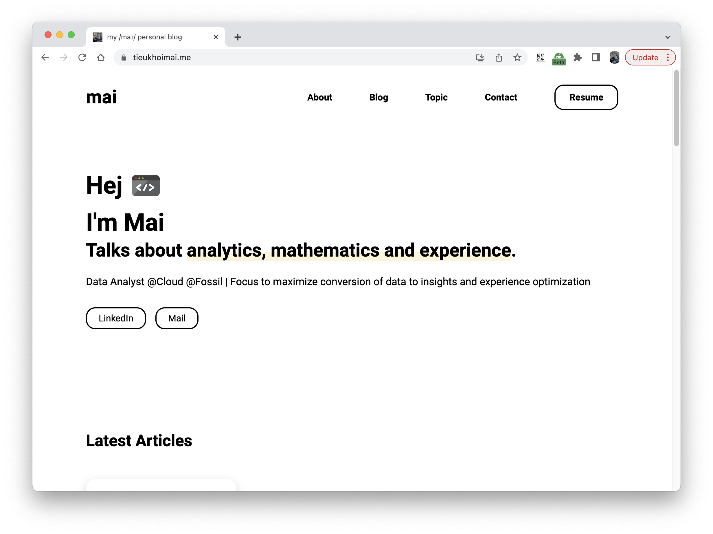

# [my /maɪ/ personal blog](https://tieukhoimai.me)

## Production

```
https://tieukhoimai.me
```

## Installation

```
$ git clone https://github.com/tieukhoimai/mia-blog 
$ gatsby develop
```

I think these below resource will be useful to you for your blog journey

- Gatsby Tutorial https://www.gatsbyjs.com/docs/tutorial/
- You can refer more gastby theme from https://www.gatsbyjs.com/starters/
- Deloy with Clouflare https://developers.cloudflare.com/pages/framework-guides/deploy-anything/

## Credits

This repo is forked from https://github.com/konstantinmuenster/gatsby-starter-portfolio-minimal-theme

