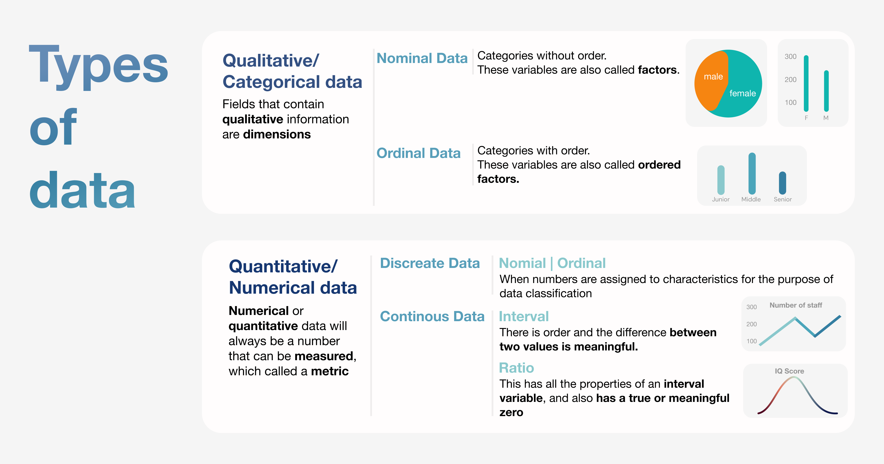

# Overview

Visualizations are tools that can help people understand difficult ideas better. And a bad choice of color can hide important information and cause confusion. Graphics can help send the right message if they use the right color palettes. Color makes a chart look better and makes it easier for people to understand the data it shows.

Based on the **types of data**, the colors used for data visualization can be put into three groups: categorical colors, sequential colors, and diverging colors.

# Types of Data

There are two main types of data is Qualitative (or categorical) and Quantitative (or numerical) data. Based on these we can classify to four primary levels of measurement are nominal, ordinal, interval, and ratio.

<table class="tg">
<thead>
  <tr>
    <th class="tg-8y1a" colspan="4">Types of data</th>
    <th class="tg-8y1a">Example</th>
  </tr>
</thead>
<tbody>
  <tr>
    <td class="tg-vask" rowspan="2">Qualitative</td>
    <td class="tg-vask" colspan="2">Nominal</td>
    <td class="tg-vask">Categories without order. These are discrete and unique categories that have no inherent order. These variables are also called  factors.</td>
    <td class="tg-vask">- Languages: English,  Chinese, Vietnamese, etc. - Relationship status: married, single, etc. - Public transportation bus, train, car, etc.</td>
  </tr>
  <tr>
    <td class="tg-fwpr" colspan="2">Ordinal</td>
    <td class="tg-fwpr">Categories with order. These are discrete and unique categories with an order. These variables are also called  ordered factors.</td>
    <td class="tg-fwpr">- Economic status: poor, middle income, wealthy - Likert scales: Very satisfied, satisfied, neutral, dissatisfied, very dissatisfied</td>
  </tr>
  <tr>
    <td class="tg-vask" rowspan="4">Quantitative</td>
    <td class="tg-vask" rowspan="2">Discrete</td>
    <td class="tg-vask">Nominal</td>
    <td class="tg-vask">Nominal data are categorical, and the categories are mutually exclusive; there is no overlap between the categories.</td>
    <td class="tg-vask">Gender: - Females are assigned the number 1 - Males are assigned the number 2</td>
  </tr>
  <tr>
    <td class="tg-vask">Ordinal</td>
    <td class="tg-vask">When numbers are purposefully assigned to data that have a sense of rank or order, but the magnitude of difference between those numbers is not known or cannot be measured.</td>
    <td class="tg-vask">- Grade score can range from as low as 0 and as high as 20.</td>
  </tr>
  <tr>
    <td class="tg-vask" rowspan="2">Continuous</td>
    <td class="tg-vask">Interval</td>
    <td class="tg-vask">- When numbers have units that are of equal magnitude as well as rank order on a scale without an absolute zero - Scales of this type can have an arbitrarily assigned "zero", but it will not correspond to an absence of the measured variable.</td>
    <td class="tg-vask">- Temperature in Fahrenheit scale: 10, 0, +10, +20, +30. </td>
  </tr>
  <tr>
    <td class="tg-vask">Ratio</td>
    <td class="tg-vask">- When numbers have units that are of equal magnitude as well as rank order on a scale with an absolute zero - Examples include: heart rate, blood pressure, distance.</td>
    <td class="tg-vask">- Distance (from zero miles/km upwards) - Time intervals</td>
  </tr>
</tbody>
</table>

 

# Colors and Data

A qualitative palette is used when the variable is a **categorical data**.  Categorical variables are those that have different labels but don't have an inherent order. 

**Categorical colors are optimized for maximum differentiation.** Use these for a nominal scale. Do not use them for **ordinal, interval, or ratio scales**. 

Some examples include country, languages, and gender. Each possible value of the variable is given a color from a qualitative palette.

In a qualitative palette, the colors for each group need to be different, and you should try to keep the palette to a maximum of six colors that have been optimized and won't be too confusing.

A sequential palette can be used when the variable that is supposed to be colored is a number or has values that are naturally ordered. Using these colors for dimensions can make it harder to see the numbers and cause people to misunderstand visualizations. Data values are given colors along a continuum, usually based on lightness, hue, or both. These are colors that get darker from light to dark.

**Sequential colors are optimized for numeric meaning**. Use these to create **ordinal and interval scales or also use these for ratio scales**. Don't use these as scales for categorical data. Using these colors for dimensions can make it harder to see the numbers and cause people to misunderstand visualizations.

If our numeric variable has a central value that makes sense, like zero, we can use a diverging palette. Diverging palettes are made up of two sequential palettes that share an endpoint at the central value. Colors on one side of the center are given values that are bigger than the center, while colors on the other side are given values that are smaller than the center.

**Diverging colors are designed to be balanced from a central midpoint.** Use these for **ordinal and ratio scales**, especially when there's a meaningful middle value. You can also use these to make interval scales. Don't use these with categorical data.

# More about Data Types | Inferential statistics

Statistical approaches are classified into two types: descriptive statistics and inferential statistics. Parametric tests are used to examine quantitative (rather than qualitative) information, whereas non-parametric tests are more typically employed for qualitative, non-numerical data.

<table class="tg">
<thead>
  <tr>
    <th class="tg-kefr">Inferential statistics</th>
    <th class="tg-kefr">Definition</th>
    <th class="tg-kefr">Characteristics</th>
    <th class="tg-kefr">Type of data</th>
    <th class="tg-kefr">Example</th>
  </tr>
</thead>
<tbody>
  <tr>
    <td class="tg-kapl" rowspan="2">Nonparametic Statistical Tests 	  </td>
    <td class="tg-73a0" rowspan="2">Refers to the use of statistical tests or methods when the data being studied comes from a sample or population of people that does not follow a normal distributed.</td>
    <td class="tg-73a0" rowspan="2">- Assumes patient population being studied is not normally distributed (i.e., as seen with outliers) - The usual central measure is a median</td>
    <td class="tg-73a0">Nominal</td>
    <td class="tg-73a0" rowspan="2">- Mann-Whitney test (assumes 2 independent groups (i.e., not related) being studied) - Kruskal-Wallis test (assumes &gt; 2 independent groups being studied/compared) - Spearman (correlation test)</td>
  </tr>
  <tr>
    <td class="tg-73a0">Ordinal</td>
  </tr>
  <tr>
    <td class="tg-f44y" rowspan="2">Parametric Statistical Analysis 	  	 </td>
    <td class="tg-jvlt" rowspan="2">Refers to the use of statistical tests or methods when the data being studied comes from a sample or population of people that is normally distributed.</td>
    <td class="tg-jvlt" rowspan="2">- Assumes patient population being studied is normally distributed - Assumes the variance is homogeneous  - The usual central measure is a mean</td>
    <td class="tg-jvlt">Interval</td>
    <td class="tg-jvlt" rowspan="2">- T-test (assumes 2 independent groups (i.e., not related) being studied) - One-way ANOVA (assumes &gt; 2 independent groups being studied/compared) - Pearson (correlation test)</td>
  </tr>
  <tr>
    <td class="tg-73a0">Ratio</td>
  </tr>
</tbody>
</table>