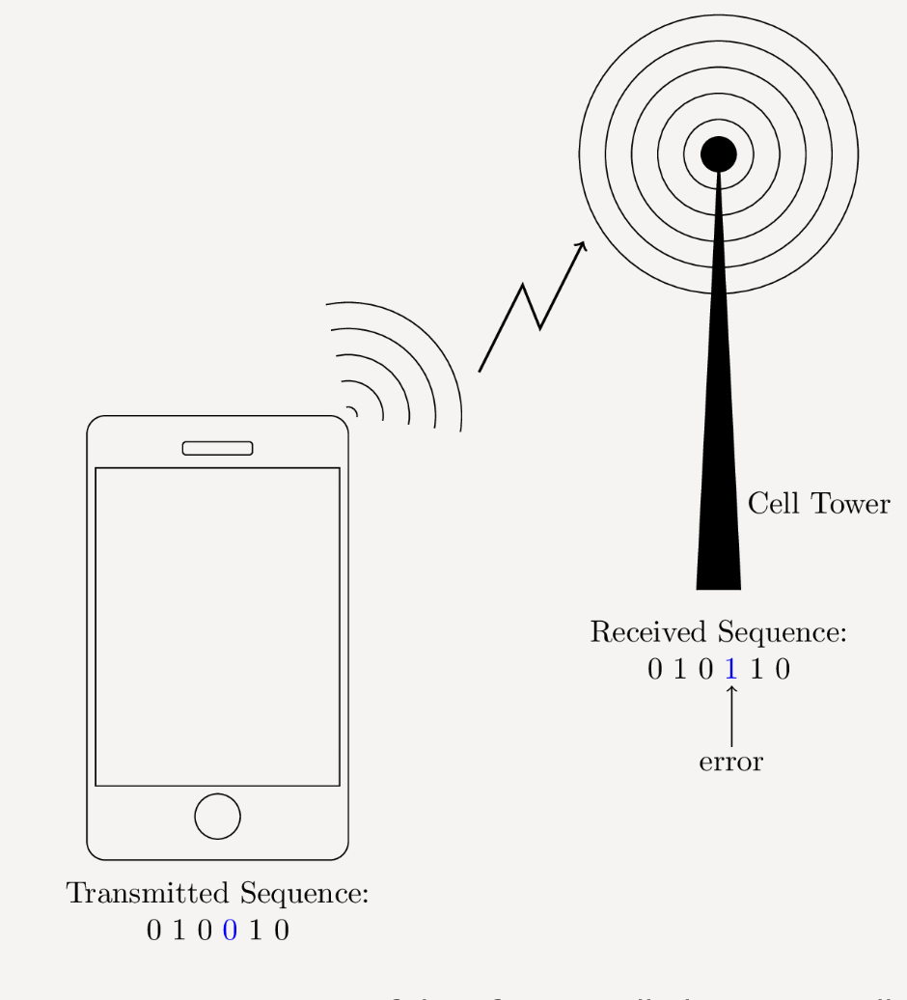
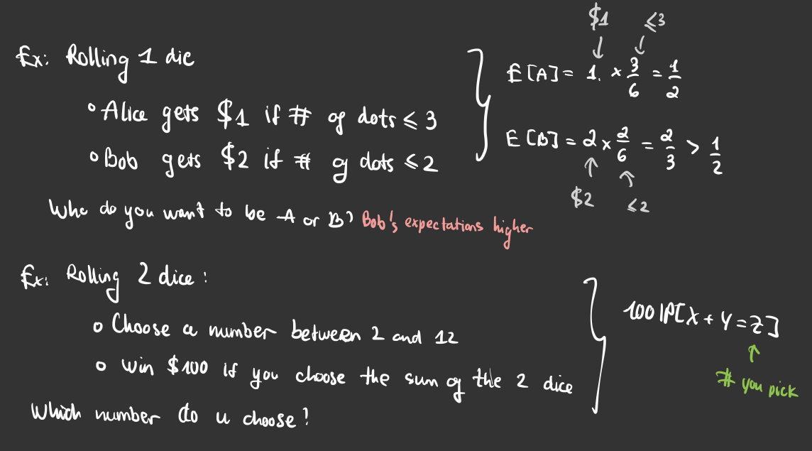
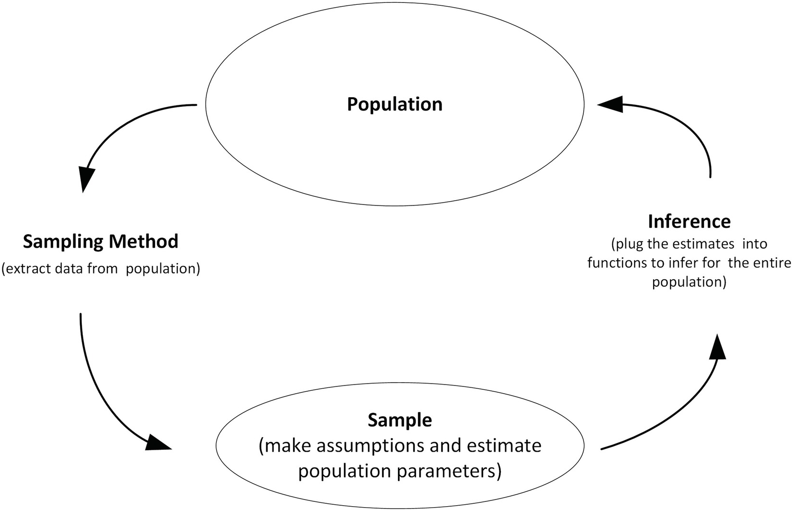
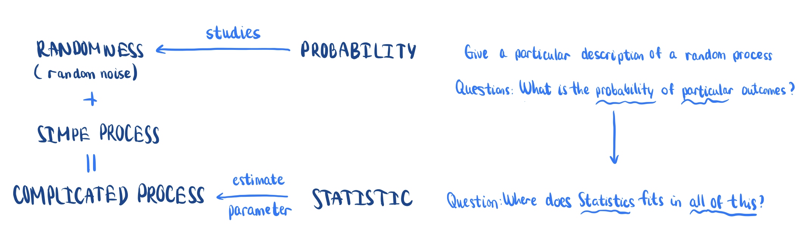

Xác suất và thống kê là khái niệm quen thuộc và thường đi cùng với nhau, chính vì vậy đôi khi chúng ta dễ nhầm lẫm rằng hai khái niệm này là một. Trong bài viết này, mình sẽ tóm tắt lại sự khác biệt giữa xác suất và thống kê, đồng thời đưa ra những định nghĩa những khái niệm cơ bản trong lĩnh vực này.

# 1. Xác suất (Probability)

Khái niệm đầu tiên mình đề cập đến là randomness - tính ngẫu nhiên là những sự kiện (events) mà chúng ta không thể dự đoán kết quả một cách chắc chắn. Một ví dụ điển hình nhất là việc tung đồng xu, khi đó sự ngẫu nhiên là một cách nghĩ thể hiện rằng chúng ta không biết đồng xu sẽ là mặt sấp hay ngửa. Khi đó xác suất đồng xu suất hiện mặt ngửa là 50%. 

Chính vì vậy, *xác suất là một môn khoa học nghiên cứu về sự ngẫu nhiên* - Probability studies randomness.

Khi nói về xác suất tức là nói về khả năng sự việc đó xảy ra. Có 2 cách hiểu phổ biến về xác suất. 

- Thứ nhất là tần số tương đối (relative frequency), có nghĩa là nếu chúng ta tung đồng xu rất nhiều lần thì khoảng 12 lần sẽ xuất hiện mặt ngửa. Khi số lần tung đồng xu tăng lên, tỷ lệ xuất hiện mặt ngửa sẽ càng tiến gần đến con số 12, cách hiểu về xác suất này là một trường hợp đặc biệt của luật số lớn (law of large numbers).
- Thứ hai, là sự định lượng về mức độ niềm tin của chúng ta rằng một điều gì đó sẽ xảy ra. Ví dụ như việc dự báo thời tiết. Khi nghĩ về khả năng trời mưa, chúng ta sẽ xem xét những điều kiện như mây, độ ẩm hay xác suất trời sẽ mưa trong những điều kiện tương tự như hiện tại và khi đó những người khác nhau sẽ đưa ra những ước lượng khác nhau về xác suất trời mưa.

Một ví dụ áp dụng xác suất là hệ thống thông tin liên lạc. Mỗi hệ thống sẽ truyền thông tin từ nơi này đến nơi khác. Khi chúng ta nói chuyện điện thoại, những gì chúng ta nói sẽ được chuyển đổi thành những chuỗi 0,1 được gọi là information bits - sau đó những bit này được chuyển từ ăng-ten điện thoại đến một tháp di động gần đó. Khi đó bài toán cần giải quyết là trong quá trình truyền sẽ luôn bị ảnh hưởng bởi nhiễu (noise). Ví dụ như điện thoại truyền chuỗi 0-1-0-**0**-1-0 nhưng chuỗi nhận được là 0-1-0-**1**-1-0. Khi đó bit thứ tư được gọi là lỗi (error) và ảnh hưởng đến chất lượng âm thanh của cuộc trò chuyện.

Nguồn: [1]

Những tiếng ồn (noise) trong đường truyền là một hiện tượng ngẫu nhiên (random phenomenon). Trước khi gửi tín hiệu đó, chúng ta sẽ không biết bits đó có bị ảnh hưởng hay không. Nó được mô tả như việc tung một đồng xu cho mỗi bits để biết bits đó có bị lỗi hay không. Lý thuyết xác suất được sử dụng rộng rãi trong thiết kế các hệ thống thông tin liên lạc hiện đại nhằm hiểu được hành vi của tiếng ồn trong các hệ thống này và thực hiện các biện pháp sửa lỗi.

Vì vậy, tính ngẫu nhiên (randomness) phổ biến ở khắp mọi nơi và lý thuyết xác suất nói một cách dễ hiểu là nghiên cứu về tính ngẫu nhiên để hiểu và quản lý tác động của nó.

Một ví dụ khác phổ biến trong môn xác suất để chúng ta thấy rõ tính ngẫu nhiên. 

- Khi chúng ta lắc xúc xắc 1 lần
    - Alice sẽ nhận được $1 nếu mặt xúc xắc ≤ 3
    - Bob sẽ nhận được $2 nếu mặt xúc xắc ≤ 2

Câu hỏi là chúng ta sẽ muốn trở thành Alice hay Bob?

Chúng ta sẽ thấy được là kỳ vọng (expectation) của Alice, kí hiệu là E[A] = 1/2 và kỳ vọng của Bob E[B] = 2/3 cao hơn Alice.

- Khi chúng ta lắc xúc xắc 2 lần
    - Hãy chọn một con số giữa 2 và 12
    - Bạn sẽ thắng 100$ nếu chọn đúng tổng của 2 con xúc xắc

Ta gọi tổng của 2 lần lắc đó chúng ta gọi là X+Y và Z là con số chúng ta chọn. Khi đó, số tiền chúng ta thằng được là 100*P[X+Y=Z] vì vậy chúng ta cần tính được xác suất X+Y=Z với mỗi Z từ 2 đến 12.

Nguồn: [2]

# 2. Thống kê (Statistic)

Tiếp tục ví dụ trên, dưới góc nhìn thống kê thì ta thấy được rằng mỗi mặt xúc xắc sẽ có xác suất là 1/6 và phát triển lên từ dữ kiện đó bằng cách tung xúc sắc cho đến khi đếm được một số và ước tính (estimate) được số đó.

Tuy nhiên với những quy trình phức tạp hơn (complicated process) - Chúng ta sẽ xem chúng như công thức sau 

Complicated process “=” Simple process + random noise

Thì chúng ta sẽ không lãng phí thời gian để tung xúc xắc mà thay vào đó Thống kê là quá trình ước lượng tham số dựa trên dữ liệu (estimate parameters from data) và dữ liệu thì đến từ những quá trình ngẫu nhiên (Data comes from random process). Điều này giống như một vòng lặp của sự thật (circle of truth)

Khi chúng ta thử nghiệm các xác suất, chúng ta được đưa cho mô hình để dự báo dữ liệu (given model, predict data) và sau đó dùng dữ liệu để ước lượng tham số và đưa ra mô hình. Trong một vài tài liệu khác, điều này được gọi là *“Central Dogma of Inference”*

(1) Thu thập một tập hợp các quan sát về quần thể hoặc hiện tượng hay còn được gọi là dữ liệu được ghi lại, vẽ đồ thị, phân tích và giải thích để thu thập thông tin hữu ích.

(2) Tuy nhiên, dữ liệu có thể thay đổi và tồn tại khả năng không chắc chắn (uncertainty) trong việc đưa ra suy luận (inference) về những dữ liệu đó.

Source: [3]

Từ đó, ta nhận thấy được rằng một mô hình xác suất (probabilistic model) hoặc suy luận thống kê (statistical inference) sẽ có các mục tiêu sau:

- Đặc trưng cho tính ngẫu nhiên hoặc “nhiễu” trong dữ liệu
- Định lượng sự không chắc chắn (uncertainty) trong các mô hình hoặc các quyết định đưa ra từ dữ liệu
- Dự đoán các quan sát hoặc quyết định trong tương lai khi đối mặt với sự không chắc chắn

Một cách khác dễ nhớ hơn, lặp lại công thức

> Complicated process “=” Simple process + random noise
> 

Vì vậy một mô hình tốt bao gồm

> (good) modeling **consists** simple process **and** noise distribution
> 

# 3. Kết luận (Conclusion)

- Xác suất nghiên cứu về sự ngẫu nhiên (randomness)
    - Đầu vào: Mô tả về một quá trình ngẫu nhiên của một tập mẫu (sample)
    - Đưa ra xác suất của một tình huống cụ thể
- Thống kê ước lượng tham số từ dữ liệu và đưa ra kết quả gần nhất có thể đối với quần thể (population)

# Reference

1. Pishro-Nik, H. (2016). Introduction to probability, statistics, and random processes.
2. Lecture 1: Introduction - **[MIT 18.650 Statistics for Applications, Fall 2016](https://ocw.mit.edu/courses/18-650-statistics-for-applications-fall-2016/)**
3. [Spatial Analysis Methods and Practice](https://www.cambridge.org/core/books/spatial-analysis-methods-and-practice/4C135005A621335D06CC63EFF17E3913) *Describe – Explore – Explain through GIS*, pp. 59 - 146